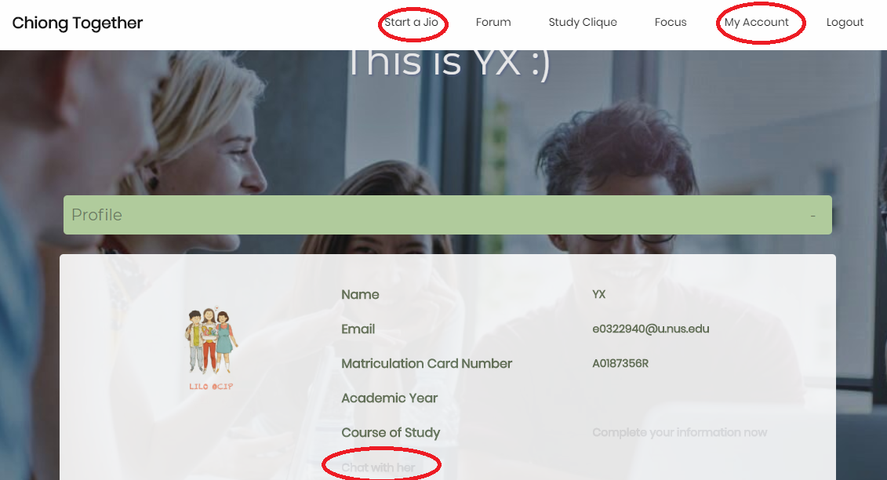
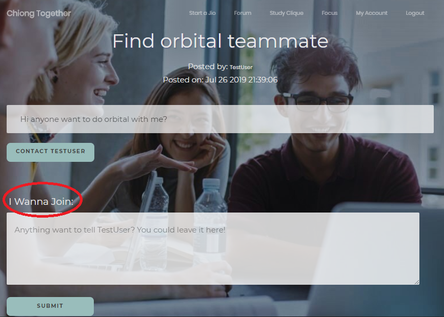

<h1> ChiongTogether</h1>

#### _A User Guide_
# 


### Introduction

> ChiongTogether is a web application project that aims to provide NUS students with a platform to find suitable people for academic related issues, such as finding project mates, competition partners or someone to study together. 
> 
> ChiongTogether is mainly in the form of forum posting. Users can send invitation to all other users by sending a public post (start a Jio).   
Users can also search for existing posts that meet their needs. They can leave a comment below if they are interested in a post, or directly chat to each other by sending private messages. 


#### How to use
To run this app you have to have [Node.js](https://nodejs.org/en/) installed.  

Clone this repository to a folder and run the following command in the root directory in the command prompt.
* Start the server: ```npm start```
* Go to localhost:5000 using any browser
* There might still be unknown bugs that can cause the server to crash. If you want to continue to develop this app you can exit the server using ```Ctrl c```. Enter developer mode using ```npm run dev``` and restart the server anytime using ```rs```.
---------------------

### Main Functionalities Overview
**1. [Registration and Login](#1-registration-and-login)**
* **Profile Page**
   
**2. [Forum Posting](#2-forum-posting)**
* **Posting (Start a Jio)**  
* **Searching**
* **Commenting**
    
**3. [Realtime Chatting](#3-realtime-chatting)**
* **Chat to another user**
* **View all chats**

-----------------

#### Page Guide

# 


##### **1. Registration and Login**
You need to login to you to access all the resources. Create or register for one in at <a href='http://localhost:5000'>http://localhost:5000</a>

* **Profile Page**
Click on "_My Account_" tab at the nevigation bar to view your account.   
You can also update your own information such as username, course of study, profile page and current academic year.  


##### **2. Forum Posting**
* **Posting (Start a Jio)**  
  You can post by clicking on the "[_Start a Jio_](http://localhost:5000/forum/startJio)" tab at the navigatin bar. 
* **Searching**
    Search bar is located at the [home page](http://localhost:5000/home). 
* **Commenting**
# 

  Leave you comment at [_"I Wanna Join"_](#singple-postpublicimagespostpng) section to let others know that you are interested.

#### **3. Realtime Chatting**
This website also allows you to directly talk to a person through private messaging. 
* **Chat to another user**
 Navigateto the profile page of the person you want to talk to and click on "[_Direct Message_](#profile-pagepublicimagesprofilepagepng)" button to chat with the person. 
* **View all chats**
  You can view all the chats you have in your [profile page](#profile-pagepublicimagesprofilepagepng).


*****
<h2><p style="text-align: center;">National University of Singapore</p></h2>

<h4> <p style="text-align: right;">Orbital 2019</p> </h4>


**_Team: ChiongTogether  
Team Members: Liu Shiru & Han Yuxuan
Advisor: Ang Khay Wee_**

************